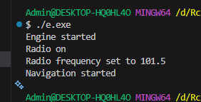

# Лабораторна робота No23
## Тема: 
    ISP & DIP: рефакторинг і DI через конструктор.
## Мета: 
    Застосувати принципи розділення інтерфейсу (ISP) та інверсії залежностей (DIP) для
    рефакторингу існуючого коду, а також реалізувати Dependency Injection (DI) через конструктор
    для зменшення зв’язаності та покращення тестування.

### Завдання
### 1. Створити новий консольний проєкт lab23.
    Успішно виконано
### 2. Реалізувати початкову структуру (порушує ISP та DIP):
    Створено проект  CarManager.cpp, в ньому створено основні класи, один інтерфейс що має нагромадження методів(вже є поршунням), також 3 реалізації цього інтерфейсу, що змушені реалізовувати кожен метод - повне порушення ISP. 
    Порушенням DIP в проекті є: Створення прямої залежності(композиції) класу CarComputer від 3 реалізацій інтерфейсу. Через це ускладнюється модифікація та тестування роботи, а також використання заглушок при реальних проектах.

### 3. Виконати рефакторинг:    
Було виконано рефакторинг та занесено код до окремого файлу RefCarManager.cpp. У ньому було розділено інтерфейс на 3 основні, кожен з яких реалізовано окремо, також використанно посилання на інтерфейси у CarComputer, та своє використання. Тепер код відповідає ISP та DIP.
### 5. Продемонструвати роботу:

### 6. UML діаграми

    діаграма проекту що порушує ISP та DIP:

    Діаграма проекту після рефакторингу
