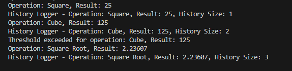

# Лабораторна робота No24
## Тема: 
    Strategy + Observer: динамічна підстановка алгоритмів + тести.
## Мета: 
    Застосувати патерни Strategy та Observer для створення гнучкої системи, яка дозволяє
    динамічно змінювати алгоритми обробки даних та автоматично сповіщати залежні компоненти
    про зміни, а також написати юніт-тести для перевірки цієї функціональності.

### • Патерн Strategy:
Було реалізовано Інтерфейс INumericOperationStrategy: який місить в собі метод Execute(). Від ньог остворено 3 реалізації. 

    SquareOperationStrategy: Обчислює квадрат числа.

    CubeOperationStrategy: Обчислює куб числа.
    
    SquareRootOperationStrategy: Обчислює квадратний корінь числа.

Після цього було реалізовано NumericProcessor для роботи з стратегіями обрахунків та їх вибором.

### • Патерн Observer:  

Було створено інтерфейс IObserver та 3 його реалізації(спостерігачі): 

    ConsoleLoggerObserver: Виводить результат та назву операції в консоль.

    HistoryLoggerObserver: Зберігає історію результатів

    ThresholdNotifierObserver: Сповіщає, якщо результат перевищує певне
    порогове значення.

Також було створено клас ResultPublisher. Він зберігає список підписаних спостерігачів та надає можливість додавати їх через метод AddObserver, метод PublishResult викликається після отримання результату обчислення та сповіщає всіх підписників, передаючи їм значення результату і назву операції.

### робота в методі Main:

