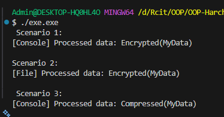

# Лабораторна робота №25

## Тема

    Інтеграція патернів (підготовка до екзамену).

## Мета

    Розробити систему, що демонструє взаємодію патернів Factory Method, Singleton, Strategy, Observer та перевірити коректність їх спільної роботи.

## Завдання

### Логування (Factory Method)

    Було реалізовано інтерфейс ILogger та його реалізації: ConsoleLogger, FileLogger.

    Було реалізовано абстрактну фабрику LoggerFactory та її реалізації:
    ConsoleLoggerFactory, FileLoggerFactory.

### Єдиний доступ до логера (Singleton)

    Було реалізовано клас LoggerManager, який створює один екземпляр логера в програмі та дозволяє змінювати фабрику створення логера під час виконання.

### Обробка даних (Strategy)

    Було реалізовано інтерфейс IDataProcessorStrategy та його реалізації:
    EncryptDataStrategy, CompressDataStrategy.

    Було реалізовано клас DataContext, який приймає стратегію та виконує обробку через неї.

### Система подій (Observer)

    Було реалізовано клас DataPublisher, який генерує подію DataProcessed після обробки даних.

    Було реалізовано клас-спостерігач ProcessingLoggerObserver, який підписується на подію DataProcessed та використовує LoggerManager для логування результату.

## Демонстраційні сценарії (метод Main)
### Сценарій 1 — Повна інтеграція

Ініціалізовано LoggerManager з ConsoleLoggerFactory.
Створено DataContext з EncryptDataStrategy.
Створено DataPublisher та підписано ProcessingLoggerObserver.
Виконано обробку даних і публікацію події.

### Сценарій 2 — Динамічна зміна логера

Після першої обробки змінено фабрику в LoggerManager на FileLoggerFactory.
Повторно виконано обробку та публікацію даних.

### Сценарій 3 — Динамічна зміна стратегії

Після першої обробки змінено стратегію в DataContext на CompressDataStrategy.
Повторно виконано обробку даних.

### Вивід в консоль

