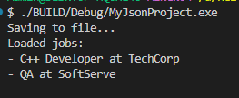

# Лабораторна робота N 28
## Тема: 
    Серіалізація об’єктів у JSON.
## Мета: 
    Навчитися серіалізувати та десеріалізувати складні об’єкти у форматі JSON, зберігати дані у файли та завантажувати їх.

## Завдання

### 1. Створити консольний проєкт lab28vN.

    Виконано успішно

### 2. Реалізувати класи предметної області згідно з варіантом (3-5 класів).

    17. Вакансії: Job, Company, JobRepository

    Реалізовано клас Company з полями: Id, title, address.

    Реалізовано клас Job з полями: Id, title, salary, company. 

### 3. Реалізувати репозиторій з JSON-серіалізацією:
    Реалізовано основні методи в завданні: 
    • Метод SaveToFileAsync()
    • Метод LoadFromFileAsync()
    • Метод Add()
    • Метод GetById(int id)

### 4. Продемонструвати роботу в Main:

    