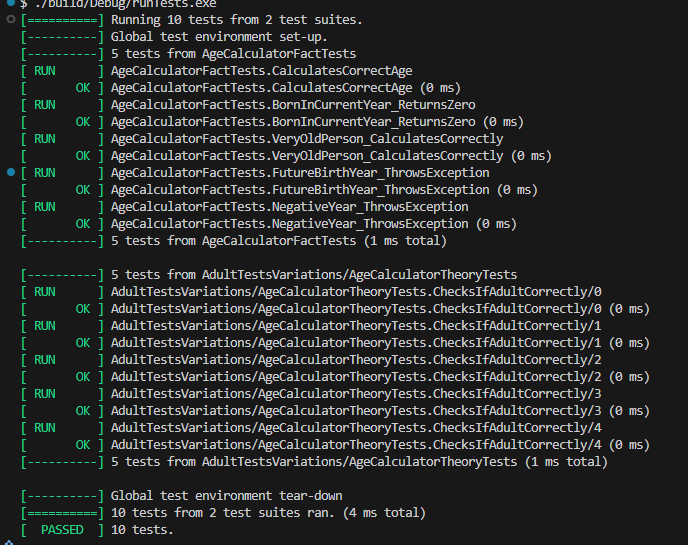

# Лабораторна робота No30
## Тема: 
    Написання юніт-тестів з xUnit.
## Мета: 
    Навчитися писати юніт-тести для власного коду за допомогою xUnit, використовуючи різні
    типи assertion та параметризовані тести.

# Завдання
### 1. Створити основний проєкт lab30vN.
    Було успішно створено папку.
### 2. Створити тестовий проєкт lab30vN.Tests:
    було створено тестовий файл, який отримав довільну назву, згідно з назвою його класу(для зручності).
### 3. Реалізувати клас згідно з варіантом (бізнес-логіка).
    Було реалізовано клас AgeCalculator та основні методи: CalculateAge, IsAdult.
### 4. Написати юніт-тести:
    Було реалізовано 10 тестів, що пройшли по всіх можливих параметрах роботи з програмою. Для реалізації аналога Fact було використано прості тести, які тестували вивід, реакцію програми на обробку помилок і тп. Для реалізації Theory було створено інші тести,struct AdultTestData(особливість Gtest), задано параметри що вносяться та результат який очікується. Система пройшла всі перевірки та коректно працювала.
### 5. Запустити тести:

