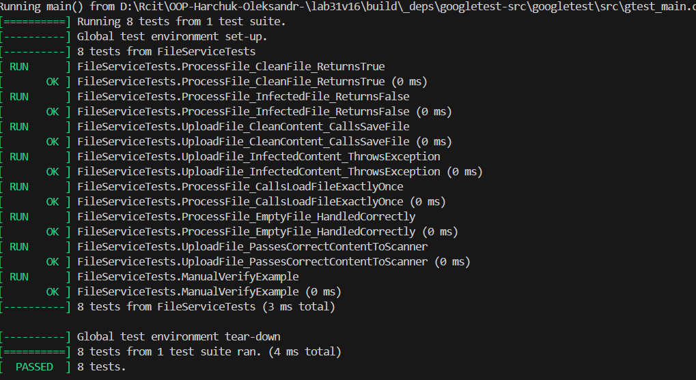

# Лабораторна робота No31
## Тема:
    Тестування з Moq (мокінг залежностей).
## Мета:
    Навчитися створювати mock-об’єкти за допомогою Moq для тестування класів з
залежностями, використовувати Setup та Verify.

### Завдання
### 1. Створити основний проєкт lab31vN.

    успішно створено

### 2. Створити тестовий проєкт lab31vN.Tests:

    Реалізовано успішно

### 3. Реалізувати Service класс з залежностями:

    Реалізація Service-класу DI: Розроблено клас FileService, який реалізує логіку обробки та завантаження файлів. Реалізовано шаблон Dependency Injection: сервіс не створює залежності сам, а отримує їх через конструктор і два інтерфейси — IFileStorage та IVirusScanner.

### 4. Написати тести з Moq:

    Використання мокінгу (Setup та Verify): Поведінку залежностей зімітовано за допомогою EXPECT_CALL.
    Setup (налаштування): реалізовано через ланцюжок WillOnce(Return(...)), що імітує відповіді бази даних або сканера.
    Verify (перевірка): реалізовано через Times(...) та Mock::VerifyAndClearExpectations, що дає точну кількість викликів потрібних методів.

### 5. Вивід з консолі:

